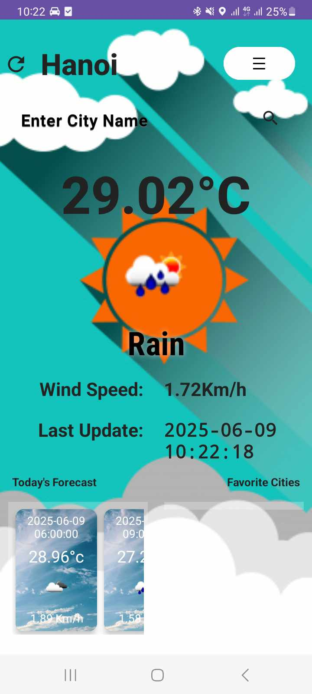
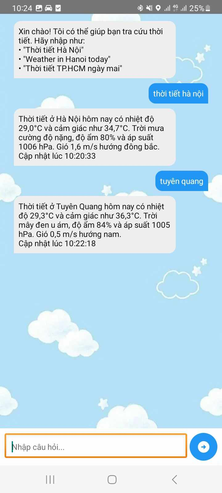

# WeatherPlus 🌤️

## 1. Giới thiệu

**WeatherPlus** là ứng dụng thời tiết dành cho thiết bị Android, được phát triển bởi nhóm sinh viên trường Đại học Công nghệ. Ứng dụng giúp người dùng theo dõi thời tiết một cách trực quan, nhanh chóng và thuận tiện. Các tính năng nổi bật bao gồm:

- ⛅ Xem thời tiết **vị trí hiện tại** theo giờ và theo ngày trong tuần.
- 🌍 Tra cứu thời tiết tại **các thành phố khác**.
- 📍 Gợi ý **địa điểm yêu thích** gần bạn như công viên, nhà hàng, quán cà phê...
- 📤 Chia sẻ nhanh thời tiết qua **Zalo**, **Facebook**, **Messenger**,...
- 🔔 Bật/tắt **thông báo thời tiết quan trọng** mỗi ngày.
- 🤖 **Chatbot thời tiết** hỗ trợ ngôn ngữ tự nhiên (Tiếng Việt và English).

## 2. Cài đặt

### Yêu cầu:
- Thiết bị Android từ **API 21 (Android 5.0)** trở lên
- Android Studio (Giraffe hoặc mới hơn)
- Kết nối Internet ổn định (WiFi/4G)

### Cách cài đặt:

1. Clone repo:
```bash
git clone https://github.com/xanhhangreal/Weather.git
```

2. Mở thư mục project bằng **Android Studio**.

3. Sync Gradle & Build Project.

4. Chạy app trên **thiết bị thật** hoặc **trình giả lập**.

## 3. Cách sử dụng

- Mở app → Xem thời tiết tại nơi bạn đang đứng.
- Dùng thanh tìm kiếm hoặc **giọng nói** để tra cứu địa điểm khác.
- Chuyển qua các tính năng: **chatbot**, **gợi ý địa điểm**, **bản đồ thời tiết**, **chia sẻ nhanh**...
- Đặt câu hỏi như:
  - `Thời tiết ở Hà Nội hôm nay thế nào?`
  - `Weather in Paris tomorrow?`

## 4. Screenshot

| Giao diện chính | Dự báo giờ | Chatbot |
|----------------|------------|---------|
|  |  |  |

> *Nếu chưa có ảnh, bạn có thể thêm thư mục `screenshots/` chứa ảnh minh họa để README hiển thị đẹp hơn.*

---

## 💡 Tác giả

**Nhóm 4 - Phát triển Ứng dụng Di động - Đại học Công nghệ (INT3120 2)**

- Nguyễn Xuân Anh - 22028257
- Nguyễn Đình Tuấn Anh - 22028279
- Nguyễn Việt Bách - 22028216

📧 Liên hệ qua GitHub hoặc email trường để biết thêm thông tin chi tiết.

---
